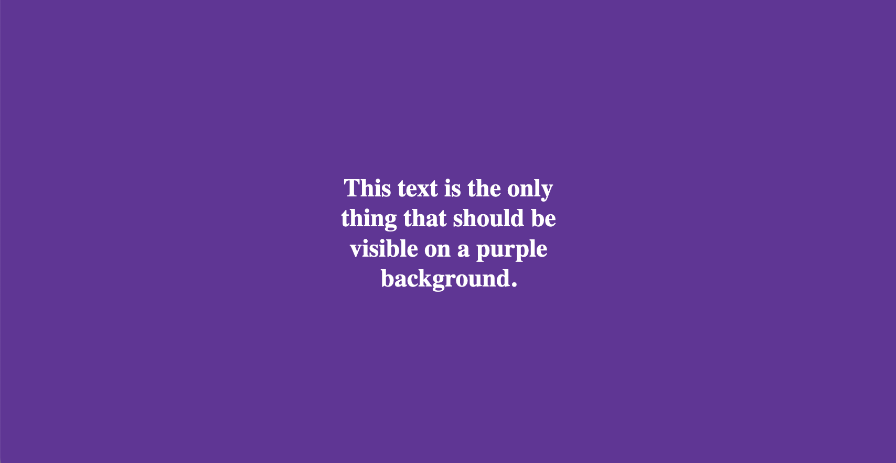

# WebKit bug: rotating CSS animations break layer order

### WebKit slow-mo demo video

2023-01-20

Demo: https://webkit-bug-2023-01-20.vercel.app  
WebKit Bugzilla: https://bugs.webkit.org/show_bug.cgi?id=250919

This repository is a reproduction of a WebKit bug where an element with a CSS 
`rotate()` animation that is hidden behind other elements creates weird render 
glitches and protrudes through the UI in unexpected ways.

The file [index.html](index.html) reproduces the issue in a WebKit based browser. The 
expected displayed content of the file is the text "*This text is the only 
thing that should be visible on a purple background*". Behind this modal 
overlay is a square loading spinner with CSS animations. The spinner is based 
on [SpinKit](https://github.com/tobiasahlin/SpinKit). In a WebKit based browser 
the loading spinner is seen partially protruding through the modal in a 
glitched way.

Browsers tested that exhibit the bug:
* Safari Version 16.2 (18614.3.7.1.5) (WebKit 605.1.15 ?)
* Orion Version 0.99.122-beta (WebKit 615.1.11.7)

Browsers tested that render as expected:
* Chrome Version 108.0.5359.124 (Official Build) (arm64)
* Firefox Version 109.0 (64-bit)

### How it should look

### How it looks in WebKit

### Background
Originally observed when implementing a [Paddle Checkout][paddle], an overlay 
iframe for collecting credit card payments. On a successful completion the 
underlying website behind the fullscreen iframe would render the same square 
loading spinner. This resulted in jarring glitches where the UI that should be 
hidden became partially overlaid over the modal.

Possible WebKit bugs:
* https://bugs.webkit.org/show_bug.cgi?id=236019
* https://bugs.webkit.org/show_bug.cgi?id=212130
* https://bugs.webkit.org/show_bug.cgi?id=181709

Other resources:
* https://bugs.webkit.org
* https://github.com/WebKit/WebKit
* https://webkit.org/bug-report-guidelines/

[paddle]: https://developer.paddle.com/guides/b4f911a991bd7-overlay-checkout
